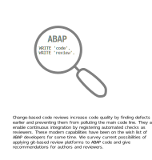
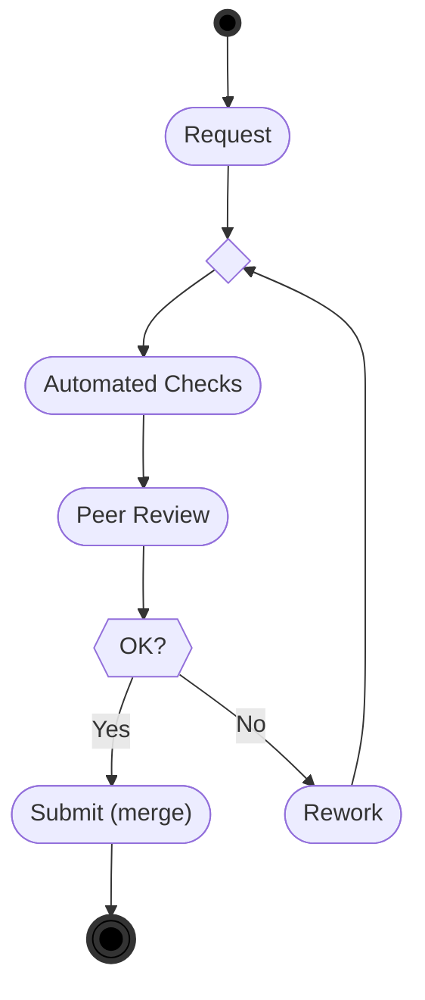
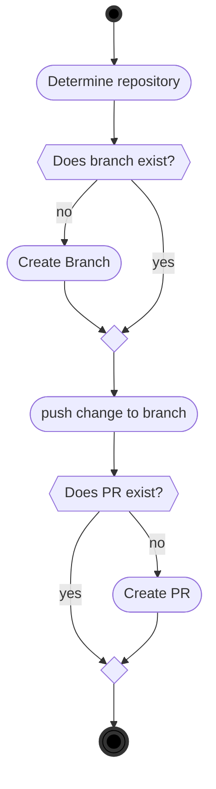

# ABAP Code Reviews
A practical guide
<div style="align:center"> 
   <p style="text-align:center;">
      </p>
</div>

## Table of Contents
- [Introduction](#1-introduction) 
- [Related Work](#2-related-work)
- [Best Practices](#3-best-practices) 
  - [Why perform code review](#31-why-perform-code-reviews)
  - [Size and Speed of Reviews](#32-size-and-speed-of-reviews)
  - [How to select Reviewers](#33-how-to-select-reviewers)
  - [Required Code Reivews](#34-required-code-reviews)
  - [Code Formatting](#35-code-formatting)
- [Tools](#4-tools)
  - [Git](#41-git)
  - [Code Review Platforms](#42-code-review-platforms)
  - [CTS](#43-cts)
  - [ABAP and Git](#44-abap-and-git)
    - [abapGit](#441-abapgit)
    - [gCTS](#442-cts)
  - [Static Analysis and Tests](#45-static-analysis-and-tests)
    - [Code Inspector (ATC)](#451-code-inspector-atc)
    - [abaplint](#452-abaplint)
    - [Third party checks](#453-third-party-checks)
  - [abap-openapi-client](#46-abap-openapi-client)
- [Scenarios](#5-scenarios)
  - [One Way Synchronization](#51-one-way-synchronization)
  - [Two Way Synchronization](#52-two-way-synchronization)
- [abapGit Examples](#6-abapgit-examples) 
  - [One Way](#61-one-way) 
    - [Setup](#611-setup) 
    - [Workflow](#612-workflow)
  - [Two Way](#62-two-way)
- [gCTS Examples](#7-gcts-examples)

Home &nbsp;&nbsp;&nbsp;&nbsp;[https://github.com/SAP/styleguides](https://github.com/SAP/styleguides)

License &nbsp;&nbsp;[Creative Commons](https://github.com/SAP/styleguides/blob/main/LICENSE)


# 1. Introduction

Code review is a measure for assuring software quality by letting developers read the code of others. While the primary goal is to increase quality by finding defects, it also fosters learning and shared code ownership.

[Continuous integration / continuous delivery](https://help.sap.com/viewer/Continuous-Integration-and-Delivery-Introduction-Guide/5ba483a2c97b4ad5ab0148f4a6c5a9ee.html) (CI/CD) is commonly seen as a prerequisite to faster delivery of cloud-based products. This comprises the ability to review, test, and, if required, veto changes before they affect every other developer working on the same repository.  This capability to validate a change in _isolation_ before integrating it is also known as [proposed commits](https://trunkbaseddevelopment.com/game-changers/#google-s-internal-devops-2006-onwards) or [pending head](https://martinfowler.com/bliki/PendingHead.html). For instance, most git platforms have implemented this concept as depicted below.



Once your version control system supports such a validation, manual change-based code reviews usually come for free because it does not matter technically whether a change is vetoed by a human vote or an automated test verdict.
While Git-based collaboration platforms offer features like [Gerrit Changes](https://www.gerritcodereview.com/) and [GitHub Pull Requests](https://docs.github.com/en/free-pro-team@latest/github/collaborating-with-issues-and-pull-requests/reviewing-changes-in-pull-requests), which already support the concept of proposed commits out of the box, ABAP Change and Transport System (CTS) only offers extension points, where a comparable flow can be implemented besides or on top to veto the release of transport requests.

This document provides an overview of possible scenarios which can be implemented in various development landscapes.

# 2. Related Work

Some work has already been done to apply git-based code reviews for ABAP:

* [ABAP code reviews with abapGit](https://blogs.sap.com/2018/03/23/abap-code-reviews-with-abapgit/) by _Eduardo Copat_, describes the general idea of exporting code to GitHub using abapGit to review it via Pull Requests.
* [How we do ABAP code review using abapGit](https://blogs.sap.com/2020/01/30/how-we-do-abap-code-review-using-abapgit/) by _Michael Pang_, explains how to use the abapGit feature **transport to branch** to review a CTS transport before it is released.
* [Create a commit in Git when an ABAP task is released](https://blogs.sap.com/2020/08/05/create-a-commit-in-git-when-an-abap-task-is-released/) by _Karin Spiegel_, elaborates on code reviews per transport by using existing BAdI interfaces to commit changes per task release to a feature branch using gCTS.
* [Static ABAP Pull Request Code Review with abapLint on Jenkins using piper-lib](https://blogs.sap.com/2020/10/12/static-abap-pull-request-code-review-with-abaplint-on-jenkins-using-piper-lib/) by _Jaqueline Bonoto_, gives a practical example setup using various tooling

# 3. Best Practices

This section contains suggestions on how to conduct code reviews effectively. Other code review guides have already dealt with this topic generically, for instance, [Google’s Engineering Practices documentation](https://google.github.io/eng-practices/). We will focus on ABAP specific considerations.

## 3.1. Why perform Code Reviews?

Code reviews can detect issues in the software that are harder to find via other methods:

* Foster [Clean code](https://github.com/SAP/styleguides/blob/main/clean-abap/CleanABAP.md) to improve **maintainability** and **readability** of code, including comments, and to avoid unnecessary **complexity**.
* Ensure the code is **well designed**.
* Consider behavioral aspects like **performance** and **security**.
* Improve **testability** of code, including test design and adequateness of tests.

Code reviews are one possibility to **share experience and knowledge** between developers. It works a bit like "asynchronous pair programming", so that colleagues can learn from each other, see different perspectives, and share know-how about all parts of the code.

Code reviews help to prevent that **code health** deteriorates over time.

## 3.2. Size and Speed of Reviews

Change-based code reviews are these days considered more effective than formal [Fagan-style code inspections](https://en.wikipedia.org/wiki/Fagan_inspection) as they were practiced some years ago. Conducted continuously, they require less effort while still finding a considerable number of defects at an earlier time. The main reason is the **smaller size** of code deltas to digest. This ensures that reviews can be performed both, more **quickly** and **thoroughly**, while keeping the process lean, i.e., less waste if changes are rejected and lower probability to block other development. Changes should be self-contained to help reviewers focus on the task at hand.

An **ABAP Transport Request** typically fulfills these criteria.

Code reviews need to be done **fast**. Hence, you need to balance between the interruption of your own work against the probability of blocking the release of other developers' transport. Rule of thumb for the maximum delay should be **one day**. Usually, the speed of code reviews will improve over time.

## 3.3. How to Select Reviewers?

In general, reviewers can be selected manually or automatically. Manual selection happens either by the author explicitly requesting reviews from colleagues with matching expertise, or by interested reviewers actively picking open changes for review. The latter requires a certain "meritocracy" culture in an organization, where novice developers may gain reputation by reviewing open changes. Some organisations may even chose to let team leads assign reviewers to changes. 

**Automated selection** of code reviewers is also possible, for instance, via round robin routing or advanced concepts like [Code Owners](https://docs.github.com/en/github/creating-cloning-and-archiving-repositories/about-code-owners). The latter enables you to define (groups of) default reviewers for certain files and folders on git level. This can be useful for critical coding parts or known hot spots.

Attributes qualifying colleagues as reviewers include:

* team assignment
* experience and seniority (also outside of the team)
* consumer role (to check if something was implemented as required)

## 3.4. Required Code Reviews

An important decision is how many code reviews are required to release a change. Most projects require at least the so-called 4-eyes-principle for every change. It is important to note the culture aspect of this configuration: This is not meant as an additional hurdle to harass developers that should be generally mistrusted. It is rather an opportunity and safety net that prevents slip errors from spreading unnoticed, because they can happen anytime to anyone. If reviews from **Code Owners** are required, individual approvals will not suffice.

In case of pair-programming, code reviews can of course be conducted much faster. Usually, a remark documenting the pair-programming should suffice.

Moreover, one could imagine also dynamic conditions that make code reviews mandatory, for instance, a significant drop in test coverage, a high number of low priority ATC messages, or changes of critical objects like DDIC or CDS, security checks, APIs and package interfaces, just to name a few. The practicability of such requirements of course depends on the capabilities of the chosen code review platform.

## 3.5. Code Formatting

The code reviewer will look through the textual changes in the source code, and even if the actual change is small,
there might be a lot of changes due to reformatting of the code.

Having a consistently formatted codebase will help keeping the size of textual changes small, and make reviewing easier.

The SAP ABAP style guide provides multiple recommendations which can be used in the development team,

* [Use your pretty printer team settings](https://github.com/SAP/styleguides/blob/main/clean-abap/CleanABAP.md#use-your-pretty-printer-team-settings)
* [Stick to a reasonable line length](https://github.com/SAP/styleguides/blob/main/clean-abap/CleanABAP.md#stick-to-a-reasonable-line-length)
* [Indent and snap to tab](https://github.com/SAP/styleguides/blob/main/clean-abap/CleanABAP.md#indent-and-snap-to-tab)
* [Align type clauses](https://github.com/SAP/styleguides/blob/main/clean-abap/CleanABAP.md#dont-align-type-clauses)
* [Close brackets at line end](https://github.com/SAP/styleguides/blob/main/clean-abap/CleanABAP.md#close-brackets-at-line-end)
* [Align parameters](https://github.com/SAP/styleguides/blob/main/clean-abap/CleanABAP.md#align-parameters)

Objects can be mass pretty printed via [abappretty](https://www.npmjs.com/package/abappretty), and developers reminded to follow the team conventions via static analysis tooling.

# 4. Tools
Various tools can be used to orchestrate the code review process, this section introduces the tooling required for conducting code reviews in the context of ABAP development.

## 4.1. Git
[Git](https://en.wikipedia.org/wiki/Git) is a popular [distributed version control system](https://en.wikipedia.org/wiki/Distributed_version_control), which helps developers work on the same codebase. Unlike ABAP, Git works with files instead of objects in a database, which allows editing any file with
any editor, and keeping multiple copies (branches) of files.

At a technical level Git is a protocol, and is typically used in connection with cloud-based hosting platforms like:

* [GitHub](https://github.com)
* [GitLab](https://gitlab.com)
* [Bitbucket](https://bitbucket.com)
* [Azure Repos](https://azure.microsoft.com/en-us/services/devops/repos/)

For an introduction to Git see:

* [Git Documentation](https://git-scm.com/doc)
* [Git Handbook](https://docs.github.com/en/get-started/using-git/about-git)

## 4.2. Code Review Platforms
Git helps keeping track of changes to files, and the Git hosting platforms add extra functionality on top of that. As explained in the [introduction](https://github.com/priyasingh199885/styleguides/blob/main/abap-code-review/src/introduction.md), the most important feature is **proposed commits**, which is the basis for code reviews.
The general idea is to keep all commits of a feature in a separate branch, propose to merge this branch to a parent or main branch, and to conduct a review conversation over this proposal.

For instance, GitHub provides [Code Reviews via Pull Requests](https://github.com/features/code-review/). Other git platforms offer similar features.

## 4.3. CTS
The Change and Transport System (CTS) helps organizing development projects in transports, both for objects in the ABAP Workbench and in Customizing. After the development is completed the change is transported between the SAP systems in the system landscape.

The complete documentation on how to configure CTS and how to set up transport landscapes is available on  [SAP Help Portal](https://help.sap.com/viewer/4a368c163b08418890a406d413933ba7/201809.latest/en-US/48c4300fca5d581ce10000000a42189c.html).

CTS also offers the possibility to integrate custom logic in the flow of transport requests via the BAdI `CTS_REQUEST_CHECK`.
In particular, the method `CHECK_BEFORE_RELEASE` is useful for vetoing the release of transports based on external conditions, like code reviews.

## 4.4. ABAP and Git
ABAP objects are stored in the underlying database, and git works on files, to enable git in ABAP, the
objects must be serialized to files and moved to the git server via the git protocol. Currently two different
tools exists that brings git and ABAP together.

### 4.4.1. abapGit
[abapGit](https://abapGit.org) is a git client written in ABAP for use with ABAP, it serializes the ABAP objects to files, and provides access to the most common git operations.

It can be [installed](https://docs.abapgit.org/guide-install.html) on any SAP system version 702 and up, requiring only a ABAP developer key for installation.

abapGit was initially released in [2014](https://blogs.sap.com/2014/07/17/git-client-for-abap-alpha-release/) and is continuously being enhanced, users can update to the latest version at any time.
[Multiple open source projects](https://dotabap.org) use abapGit for development and installation into systems.

### 4.4.2. gCTS
A first set of features of git-enabled CTS (gCTS) is available with SAP S/4HANA 1909. You can find the documentation on how to configure and use gCTS on the SAP Help Portal: [Git-enabled Change and Transport System](https://help.sap.com/viewer/4a368c163b08418890a406d413933ba7/201909.000/en-US/f319b168e87e42149e25e13c08d002b9.html). A good starting point is Karin Spiegel’s blog post [gCTS is here](https://blogs.sap.com/2019/11/14/gcts-is-here/).

To get the idea of gCTS and what is planned for future releases, please refer to its [statement of direction](https://support.sap.com/content/dam/support/en_us/library/ssp/tools/Software-logistic-tools/Ideas_CI_ABAP_V3.pdf).

## 4.5. Static Analysis and Tests

To make code reviews effective, it is useful to conduct automated checks upfront. For instance, machines are much cheaper and more effective at finding typical slip errors by static code analysis than human reviewers. Hence it is desirable to perform such checks upfront before peer code reviewers are bothered with a change.

Git platforms usually allow developers to connect continuous integration pipelines to their repositories so that arbitrary automated checks can be configured.
In the following, we will look into tools running ABAP-specific checks in such pipelines.

### 4.5.1. Code Inspector (ATC)
The developer can use [ATC](https://help.sap.com/viewer/c238d694b825421f940829321ffa326a/7.51.7/en-US/4ec5711c6e391014adc9fffe4e204223.html) to check the working copy in an ABAP system.

If the state of the ABAP system matches the git state, ATC can be executed locally for the scope given in the transport or pull request to help the code reviewer.

In addition to the standard checks provided by SAP, there are open source projects that provide additional checks:

* [code pal for ABAP](https://github.com/SAP/code-pal-for-abap)
* [abapOpenChecks](https://abapopenchecks.org)

It is however not so trivial (yet) to execute ATC as part of a continuous integration pipeline.

One possibility is to use BAdI `CTS_REQUEST_CHECK` to execute ATC programmatically during the release of a transport.

In case the SAP ABAP Development Tools for Eclipse are already configured for your system, you could use its REST APIs to trigger ATC and ABAP Unit externally. This is what, for instance, the pipeline step [gctsExecuteABAPUnitTests](https://www.project-piper.io/steps/gctsExecuteABAPUnitTests/) of project Piper does.

With SAP BTP ABAP Environment (a.k.a. [Steampunk](https://blogs.sap.com/2019/08/20/its-steampunk-now/)) and newer SAP S/4 HANA releases, there is also the possibility to use dedicated REST end-points for such continuous integration scenarios. There is even a dedicated [ABAP Environment Pipeline](https://www.project-piper.io/pipelines/abapEnvironment/introduction/) for that.
These newer features are of course not available to customers working on older releases.

To call the REST endpoints on the ABAP system, the pipelines must have network access to the ABAP system.

```mermaid
%%{ init: { 'flowchart': { 'curve': 'bumpX' } } }%%
 flowchart LR 
    A(abap1) -->|1: push| B([git])
    B -->|2: trigger| C[pipeline]
    C -->|3: REST| D(abap2)
    D --> |5: ATC| D
    B -->|4: pull| D
 ```

### 4.5.2. abaplint
[abaplint](https://abaplint.org) is a open source static analysis tool for ABAP, it works on files serialized by abapGit.
abaplint is "cloud native" and built to [run on CI](https://github.com/abaplint/abaplint/blob/main/docs/ci/README.md) pipelines, and only requires that the pipeline can access the files in git. There are no specific system requirements, as abaplint can run on the lowest/free pipeline tiers.

Multiple [rules](https://rules.abaplint.org) can be configured and the corresponding configuration file  `abaplint.json` is stored in the repository along with the code, following the same change process as the code.

The [abaplint.app](https://abaplint.app) can be installed via one-click from [Github Marketplace](https://github.com/marketplace/abaplint), and provides extra features like automatic suggestions and code insights.

The developers can check their working copy using [abaplint-sci-client](https://github.com/abaplint/abaplint-sci-client) which integrates the rules into Code Inspector/ATC. And the linter also works in [vscode](https://marketplace.visualstudio.com/items?itemName=larshp.vscode-abaplint) or running [standalone](https://playground.abaplint.org) in a browser window.

```mermaid
 %%{ init: { 'flowchart': { 'curve': 'natural' } } }%%
 flowchart LR 
    A(abap) -->|1: push| B([git])
    B -->|2: trigger| C([pipeline])
    B -->|3: pull| C
    C --> |4: abaplint| C
 ```

### 4.5.3. Third party checks

There are other tools from third party vendors that can be also used for ABAP code analysis. 

For instance, [SonarSource ABAP](https://rules.sonarsource.com/abap/) can be used to check ABAP source serialized by abapGit. 

## 4.6. abap-openapi-client

External check services often have an [OpenAPI](https://swagger.io/docs/specification/about/) definition. Unfortunately, there is no standard way of consuming such OpenAPI services in ABAP yet. An emerging open source OpenAPI client for ABAP can be found at https://github.com/abap-openapi/abap-openapi-client
    
# 5. Scenarios

In this section we look at typical scenarios how git-based code reviews and classical ABAP CTS transports can be combined.
We assume the SAP ABAP development application servers have network access to the code review platform, e.g., GitHub.

## 5.1. One Way Synchronization

By one-way we mean that CTS is the primary source of truth of your component. It is in full control of your software lifecycle. Git is only used for code review purposes as a secondary persistence or USB-stick-like export channel.
Developers work normally, releasing transports via CTS as configured per transport layer.

This setup is recommended for scnearios where multiple developers work on the same repostiory in the same system,
pulling code into the system might overwrite ongoing changes by other developers, allowing only pushes will avoid this problem.

```mermaid
%%{ init: { 'flowchart': { 'curve': 'basis' } } }%%
graph TD
    A(fa:fa-user Developer 1) --> B(abap)
    C(fa:fa-user Developer 2) --> B
    D(fa:fa-user Developer 3) --> B
    B -->|push| E([git])
 ```
 The only difference are the new review steps, which are conducted via an ABAP git client (either abapGit or gCTS) on a code review platform like GitHub.
Even though code reviews could also be conducted independently from transport releases, it is more efficient to synchronize both tightly because their granularity typically captures a logical unit of work.

This scenario requires minimal git knowledge, as developers will continue working with normal CTS requests/tasks.

## 5.2. Two Way Synchronization

In contrast, open source projects or reusable assets developed by partners for multiple clients usually have a lifecycle of their own, independent of the target systems they are deployed to. Git becomes the primary persistence. Classical CTS is only used optionally for software logistics of the consuming target project (or you rely completely on gCTS).
All git operations are manually performed by the developer using the ABAP git client (either abapGit or gCTS), including the pull of changes back from git into AS ABAP.

One developer would typically work on one repository in a system at a time, utilizing both the push and pull features in the git client.

 ```mermaid
%%{ init: { 'flowchart': { 'curve': 'cardinal' } } }%%
 graph LR
    A(fa:fa-user One Developer) --> B(abap)
    B --->|push| C([git])
    C -->|pull| B
```
Conflicts resulting from concurrent modification of the same objects on different systems need to be resolved on git level.

# 6. abapGit Examples

## 6.1. One Way

There are lots of ways to setup code reviews, this section introduces a simple implementation of the [One Way Synchronization](#One Way Synchronization), with commits for each task release, the example can be extended according to the needs of each organization.

A sample abapGit setup is provided at [https://github.com/abapGit/abapgit-review-example](https://github.com/abapGit/abapgit-review-example), it can be installed via abapGit, and works together with GitHub.

### 6.1.1. Setup

GitHub setup required,

1. [Create repositories](https://docs.github.com/en/github/getting-started-with-github/create-a-repo)
2. If needed, [setup branch protection](https://docs.github.com/en/github/administering-a-repository/about-protected-branches)
3. [Enable automatic branch deletion](https://docs.github.com/en/github/administering-a-repository/managing-the-automatic-deletion-of-branches)

Multiple setup steps are required in the development system,

1. abapGit development edition [installed](https://docs.abapgit.org/guide-install.html#install-developer-version)
2. Connectivity from the ABAP system to Github, [SSL setup](https://docs.abapgit.org/guide-ssl-setup.html)
3. [Background user authentication](https://docs.abapgit.org/ref-exits.html#create_http_client)
4. Online repositories are [created](https://docs.abapgit.org/guide-online-install.html) and linked to the development packages
5. Enable abapGit [write protection](https://docs.abapgit.org/settings-local.html#write-protected) for the repos

### 6.1.2. Workflow

For the release of each task, the following steps are performed:


For release of request,

1. Check PR is released, if not the request cannot be released 
   abapGit works on object level(`R3TR`), while the transport system works on subobject level(`LIMU`), 
   if mirroring transports to git and subobjects exists in multiple transports, the abapGit based example will give an error.

Transports must consistently match the git repositories, an error will be issued if a transport contains objects from multiple git repositories.

The example is provided as a starting point, different organizations have different requirements and work processes, the example can be adjusted to fit any requirements.

## 6.2. Two Way

The developer uses the normal UI of abapGit, [pushing and pulling](https://docs.abapgit.org/) all changes.

If git is the only destination for the code, suggest disabling CTS transports to make it faster to do changes, eg. by developing in local packages.
<div style="align:center"> 
   <p style="text-align:center;">
      </p>
</div>

# 7. gCTS Examples

In principle, gCTS can also be used like a Git client for implementing a similar code review flow as in the previous example.

A combination with classical CTS steps like task and transport releases, which extends it towards "decentralized development", is described in [Create a commit in Git when an ABAP task is released](https://blogs.sap.com/2020/08/05/create-a-commit-in-git-when-an-abap-task-is-released/).
    
