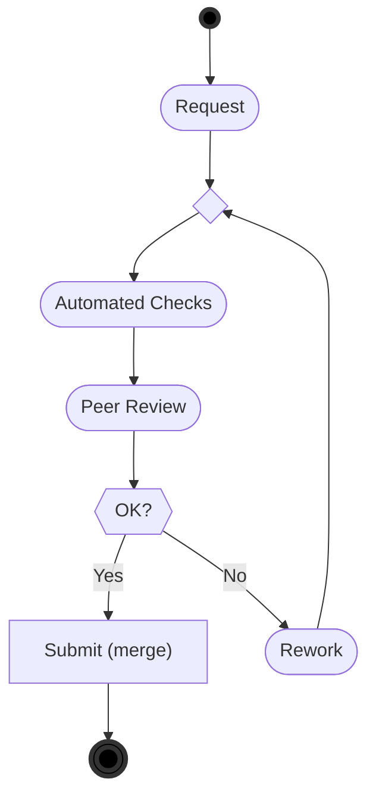

```mermaid
%%{ init: { 'flowchart': { 'curve': 'basis' } } }%%
flowchart TB

A((" ")):::startClass --> B([Request])
B --> S{" "}
S --> C([Automated Checks])
C --> D([Peer Review])
D --> E{{OK?}}
E -->|Yes| F["Submit (merge)"]
E -->|No | G([Rework])
G -->S
F --> H(((" "))):::endClass
classDef startClass fill:black,stroke:#333,stroke-width:4px;
classDef endClass fill:black,stroke:#333,stroke-width:4px;
```
