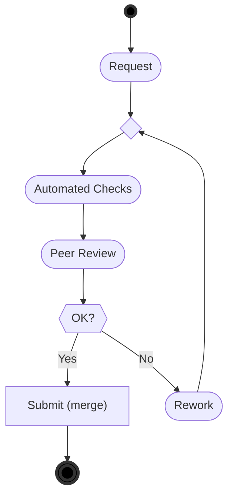

Home &nbsp;&nbsp;&nbsp;&nbsp;[https://github.com/SAP/styleguides](https://github.com/SAP/styleguides)

License &nbsp;&nbsp;[Creative Commons](https://github.com/SAP/styleguides/blob/main/LICENSE)

# 1. Introduction

Code review is a measure for assuring software quality by letting developers read the code of others. While the primary goal is to increase quality by finding defects, it also fosters learning and shared code ownership.

[Continuous integration / continuous delivery](https://help.sap.com/viewer/Continuous-Integration-and-Delivery-Introduction-Guide/5ba483a2c97b4ad5ab0148f4a6c5a9ee.html) (CI/CD) is commonly seen as a prerequisite to faster delivery of cloud-based products. This comprises the ability to review, test, and, if required, veto changes before they affect every other developer working on the same repository.  This capability to validate a change in _isolation_ before integrating it is also known as [proposed commits](https://trunkbaseddevelopment.com/game-changers/#google-s-internal-devops-2006-onwards) or [pending head](https://martinfowler.com/bliki/PendingHead.html). For instance, most git platforms have implemented this concept as depicted below.

Once your version control system supports such a validation, manual change-based code reviews usually come for free because it does not matter technically whether a change is vetoed by a human vote or an automated test verdict.
While Git-based collaboration platforms offer features like [Gerrit Changes](https://www.gerritcodereview.com/) and [GitHub Pull Requests](https://docs.github.com/en/free-pro-team@latest/github/collaborating-with-issues-and-pull-requests/reviewing-changes-in-pull-requests), which already support the concept of proposed commits out of the box, ABAP Change and Transport System (CTS) only offers extension points, where a comparable flow can be implemented besides or on top to veto the release of transport requests.

This document provides an overview of possible scenarios which can be implemented in various development landscapes.
