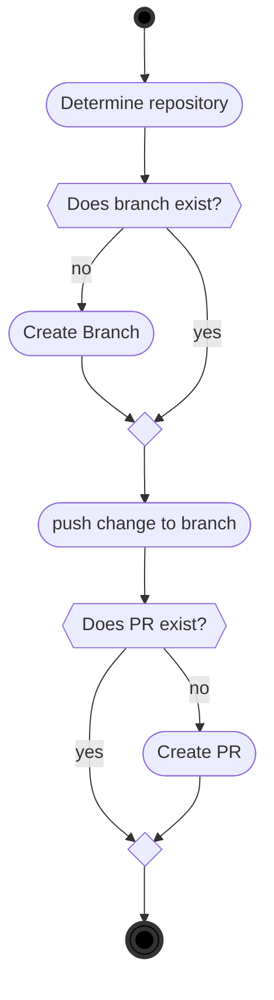

# 6. abapGit Examples

## 6.1. One Way

There are lots of ways to setup code reviews, this section introduces a simple implementation of the [One Way Synchronization](#One Way Synchronization), with commits for each task release, the example can be extended according to the needs of each organization.

A sample abapGit setup is provided at [https://github.com/abapGit/abapgit-review-example](https://github.com/abapGit/abapgit-review-example), it can be installed via abapGit, and works together with GitHub.

### 6.1.1. Setup

GitHub setup required,

1. [Create repositories](https://docs.github.com/en/github/getting-started-with-github/create-a-repo)
2. If needed, [setup branch protection](https://docs.github.com/en/github/administering-a-repository/about-protected-branches)
3. [Enable automatic branch deletion](https://docs.github.com/en/github/administering-a-repository/managing-the-automatic-deletion-of-branches)

Multiple setup steps are required in the development system,

1. abapGit development edition [installed](https://docs.abapgit.org/guide-install.html#install-developer-version)
2. Connectivity from the ABAP system to Github, [SSL setup](https://docs.abapgit.org/guide-ssl-setup.html)
3. [Background user authentication](https://docs.abapgit.org/ref-exits.html#create_http_client)
4. Online repositories are [created](https://docs.abapgit.org/guide-online-install.html) and linked to the development packages
5. Enable abapGit [write protection](https://docs.abapgit.org/settings-local.html#write-protected) for the repos

### 6.1.2. Workflow

For the release of each task, the following steps are performed:

For release of request,

1. Check PR is released, if not the request cannot be released 
   abapGit works on object level(`R3TR`), while the transport system works on subobject level(`LIMU`), 
   if mirroring transports to git and subobjects exists in multiple transports, the abapGit based example will give an error.

Transports must consistently match the git repositories, an error will be issued if a transport contains objects from multiple git repositories.

The example is provided as a starting point, different organizations have different requirements and work processes, the example can be adjusted to fit any requirements.

## 6.2. Two Way

The developer uses the normal UI of abapGit, [pushing and pulling](https://docs.abapgit.org/) all changes.

If git is the only destination for the code, suggest disabling CTS transports to make it faster to do changes, eg. by developing in local packages.

 
   

      

