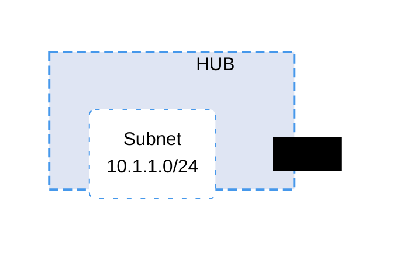

<link rel="stylesheet" href="https://use.fontawesome.com/releases/v5.0.7/css/all.css">

```mermaid
flowchart LR
    subgraph Border
        subgraph vNet[HUB]
            direction TB
            Subnet("Subnet <br /> 10.1.1.0/24")
            Subnet("Subnet <br /> 10.1.1.0/24")
            vNetIcon["<br /><img class='Icon' src='../images/networking/vnet.svg' />..."]
        end
        
    end
%% Defining Class Styles
classDef Border fill:#fff,stroke:#fff,stroke-width:4px,color:#fff,stroke-dasharray: 5 5;
classDef vNet fill:#dfe5f3,height:120px,stroke:#4698eb,stroke-width:2px,color:#000,stroke-dasharray: 8 4,width:214px;
classDef Subnet fill:#fff,stroke:#4698eb,stroke-width:1px,color:#000,stroke-dasharray: 4 8;
classDef Icon margin:0px, stroke-width:0px, padding:0px, fill:#000, position:absolute, bottom:0px, right:0px;

%% Custom Styles

%% Assigning Nodes to Classes
class Border Border;
class vNet vNet;
class Subnet Subnet;
class vNetIcon Icon;
        
```
