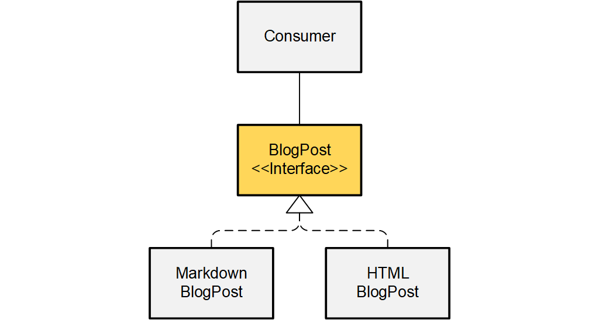
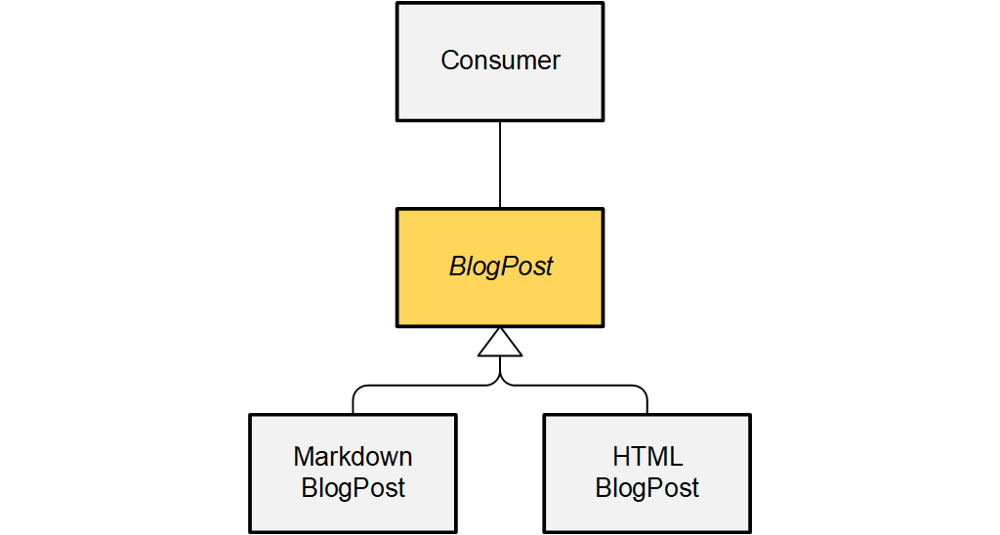
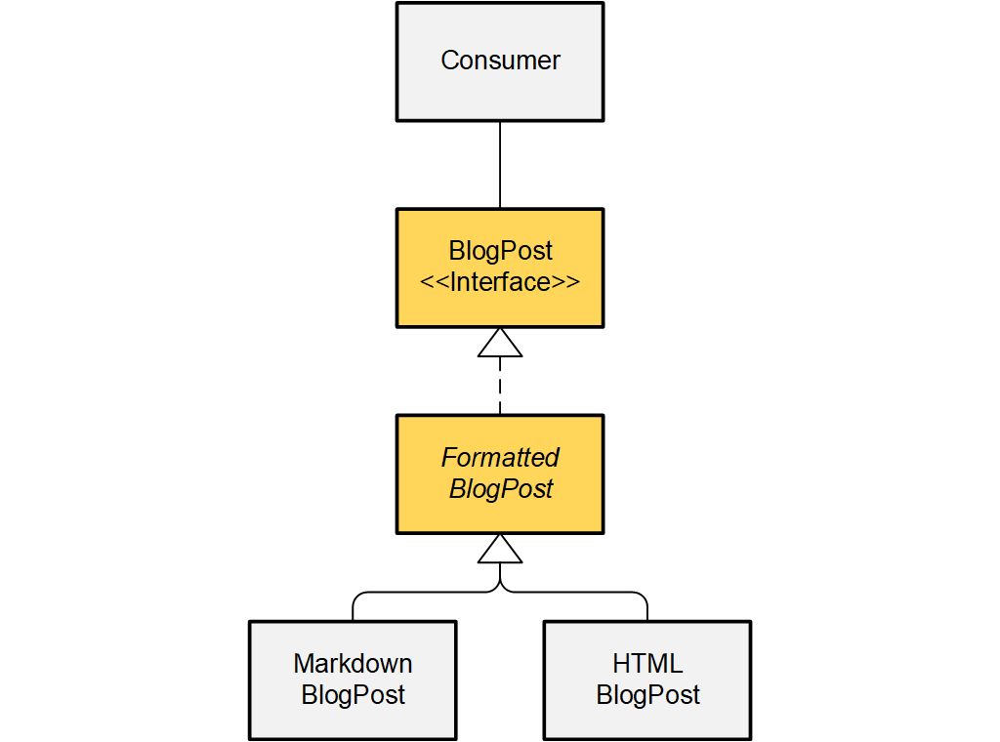

# Interfaces vs. Abstract Classes

Although interfaces and abstract classes share some properties,
they are not equivalent and you should not treat one
as an alternative for the other.

Interfaces are there to share definitions.
They specify how things are supposed to interact,
without imposing any expectations
what the implementation should look like.

Abstract classes are there to share implementations.
They also specify interaction,
but in a way that already plots a path how to implement it,
probably even assisting that implementation with code.

Instead of asking _"should I use an interface or an abstract class?"_,
usually the clean way will be to state that _"I will use an interface"_,
followed by the question _"should I use an abstract class to implement it?"_.

## Interfaces

```ABAP
INTERFACE /clean/blog_post.
  METHODS publish.
ENDINTERFACE.
```

Interfaces allow connecting any kind of code,
as long as it satisfies the interface.

They don't impose any
side expectations or restrictions upon the implementation.

In turn, they don't help implementing the required methods
with default code or helper methods.

```ABAP
CLASS /clean/markdown_blog_post DEFINITION PUBLIC CREATE PUBLIC.
  PUBLIC SECTION.
    INTERFACES /clean/blog_post.
ENDCLASS.

CLASS /clean/markdown_blog_post IMPLEMENTATION.
  
  METHOD publish.
  ENDMETHOD.
  
ENDCLASS.
```



> **Class diagram.**
The `BlogPost` interface has two alternative
implementations `MarkdownBlogPost` and `HTMLBlogPost`.
Both fulfill the same "contract", specified by  `BlogPost`,
but don't share any code.

## Abstract classes

```ABAP
CLASS /clean/blog_post DEFINITION PUBLIC ABSTRACT CREATE PROTECTED.
  PUBLIC SECTION.
    METHODS publish ABSTRACT.
ENDCLASS.

CLASS /clean/blog_post IMPLEMENTATION.
ENDCLASS.
```
An abstract class differs from regular classes in that it can’t be instantiated. Only 
sub-classes of the abstract class can be instantiated. An abstract class should contain 
at least one abstract method. An abstract method is declared in the abstract class, 
and then implemented in the sub-classes of the abstract class.

Abstract classes allow connecting only code that
fits the inheritance pattern.

On the one hand, they unify code and design across objects-of-a-kind,
making it easier to implement things by providing default implementations,
frames, and helper methods.

On the other hand, they squeeze sub-classes into their predefined scheme,
and force them to accept any code they provide.

```ABAP
CLASS /clean/markdown_blog_post DEFINITION
    PUBLIC CREATE PUBLIC
    INHERITING FROM /clean/blog_post.
  PUBLIC SECTION.
    METHODS constructor.
    METHODS publish REDEFINITION.
ENDCLASS.

CLASS /clean/markdown_blog_post IMPLEMENTATION.

  METHOD constructor.
    super->constructor( ).
  ENDMETHOD.
  
  METHOD publish.
  ENDMETHOD.
  
ENDCLASS.
```



> **Class diagram.**
The abstract class `BlogPost` has two sub-classes
`MarkdownBlogPost` and `HTMLBlogPost`.
Both fit into the "frame" specified by `BlogPost`,
probably inheriting some methods and attributes from their super-class.

## Comparison

- An abstract class needs more code
because you always have to provide an `IMPLEMENTATION`,
even if it is completely empty.

- An abstract class can reduce the amount of code needed by providing 
a default behavior in a non-abstract method. If such a method 
would have been part of the interface, it would have to be 
implemented separately for each class implementing the interface.

- A class can implement multiple interfaces,
but can inherit only one interface-like abstract class. Remember to 
[favor composition over inheritance](../CleanABAP.md#prefer-composition-to-inheritance), though.

- Inheriting from the interface-like abstract class
disables inheriting from other classes,
preventing the sub-class from exploiting inheritance for other aspects.

- Interfaces have no optional methods,
such that adding a method requires you
to adjust all implementations.

- Interfaces provide only `PUBLIC` components,
while abstract classes can provide `PROTECTED` parts as well,
sharing something with the sub-class but not with the rest of the world.

- Sub-class constructors must call `super->constructor( )`,
even if the abstract class does not have a constructor.

- The abstract class has power over the sub-class's instantiation behavior,
being able to suppress instantiation completely with `CREATE PRIVATE`.

- The abstract class has power over the sub-class's code,
being able to add members and constructor code that may
simplify but also interfere with or even break the sub-class's code.

- Unit testing is easier with interfaces,
because they allow plugging in any kind of test double.
Interface-like abstract classes require the test double
to inherit the abstract class, probably involuntarily
running code included in it, esp. its constructor.

## Combination

Instead of using abstract classes as alternative to interfaces,
you should use both in combination to decouple dependencies.

```ABAP
INTERFACE /clean/blog_post.
  METHODS publish.
ENDINTERFACE.
```

```ABAP
CLASS /clean/formatted_blog_post DEFINITION PUBLIC ABSTRACT CREATE PROTECTED.
  PUBLIC SECTION.
    INTERFACES /clean/blog_post.
ENDCLASS.

CLASS /clean/formatted_blog_post IMPLEMENTATION.

  METHOD /clean/blog_post~publish.
    " default implementation
    " sub-classes can use it
    " or override the method with something else
  ENDMETHOD.
  
ENDCLASS.
```



> **Class diagram.**
The interface `BlogPost` specifies the "contract"
that all blog posts will fulfill.
The developers decided to use an inheritance scheme to implement
different "flavors" of blog posts,
using an abstract class `FormattedBlogPost` with two sub-classes
`MarkdownBlogPost` and `HTMLBlogPost`.
